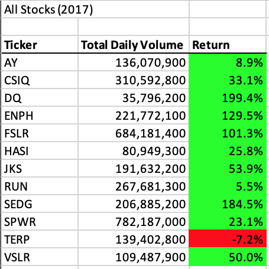
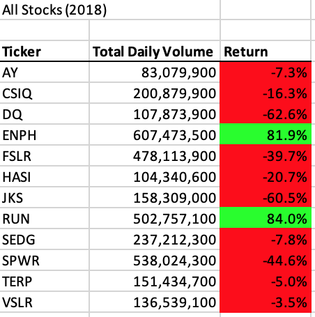
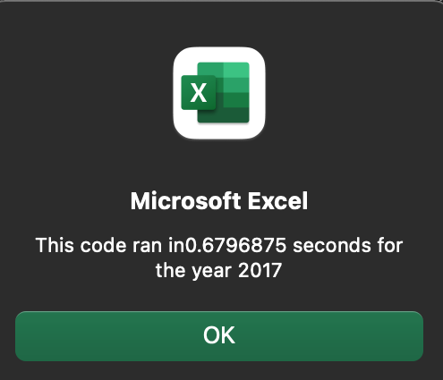
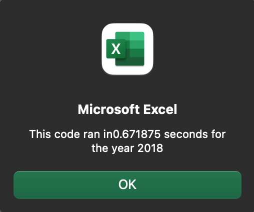
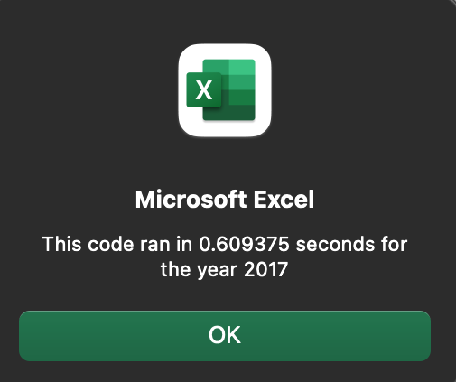
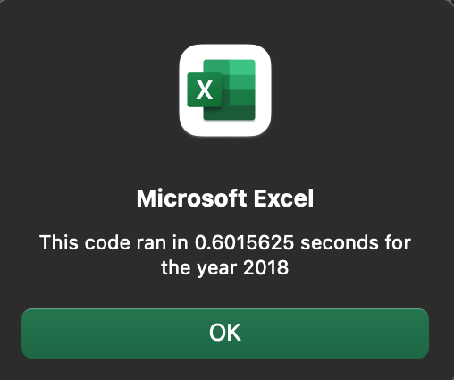

# Stock Analysis

## Overview of Project

### Purpose
The purpose of this project was to:
    1. analyze stock market data for 2017 and 2018 using VBA and 
    2. practice refactoring the VBA code.

## Results

### Stock Analysis - 2017 vs 2018
As depicted in the screenshots below, the results show that stocks overall had higher returns in 2017 than they did in 2018. In 2018, nearly all stocks shrunk except for ENPH and RUN. Even then, ENPH had a higher return in 2017. RUN is the only stock that had higher returns in 2018 than it did in 2017.

  

### Refactoring the VBA Code
  

  

## Summary

### Refactoring: Advantages and Disadvantages

### Pros and Cons Relative to Refactoring the Original Script